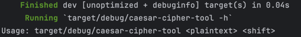
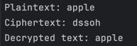
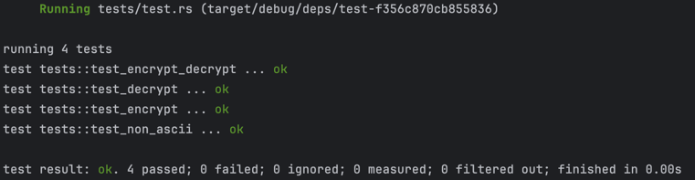

[](https://github.com/nogibjj/IDS706-MiniProject7-RustScriptCli/actions/workflows/lint.yml)
[](https://github.com/nogibjj/IDS706-MiniProject7-RustScriptCli/actions/workflows/tests.yml)


# Rust Data Engineering

## Goal

> Duke University IDS 706 Weekly Mini Project 7

Requirements: Package a Python script into a command-line tool and write a user guide.

## Project Description

This project is a simple command-line tool that implements a Caesar cipher.  The tool takes a text file as input and outputs the encrypted text to a file.  The tool also supports decrypting the text file.


## Pre-preparation

1. Install Rust
- `curl --proto '=https' --tlsv1.2 -sSf https://sh.rustup.rs | sh`
2. Clone this repository or download the source code.
3. Navigate to the project directory `caesar-cipher`.
   - run `"cargo clean"` to clean the project.
   - run `"cargo build"` to build the project.
4. Or go to the directory `caesar-cipher` and run the command `cargo run -- -h` to see the help message.

## Usage

After you have built the project, you can run the command `cargo run -- -h` to see the help message.



### Option1:
You could run by the following command by the help message.

```bash
 target/debug/caesar-cipher-tool <plaintext> <shift>
```

### Examples:
```bash
target/debug/caesar-cipher-tool "apple" 3 
```



### Option2:

You could also run by using cargo:

```bash
cargo run <plaintext> <shift>
```

### Examples:
```bash
cargo run "apple" 3 
```


## Test

run `cargo test`




## References

1. https://github.com/nogibjj/rust-data-engineering

* [Rust Collections](https://doc.rust-lang.org/std/collections/index.html)
* [GitHub Copilot CLI](https://www.npmjs.com/package/@githubnext/github-copilot-cli)
* [Rust Fundamentals](https://github.com/alfredodeza/rust-fundamentals)
* [Rust Tutorial](https://nogibjj.github.io/rust-tutorial/)
* [Rust MLOps Template](https://github.com/nogibjj/mlops-template)
